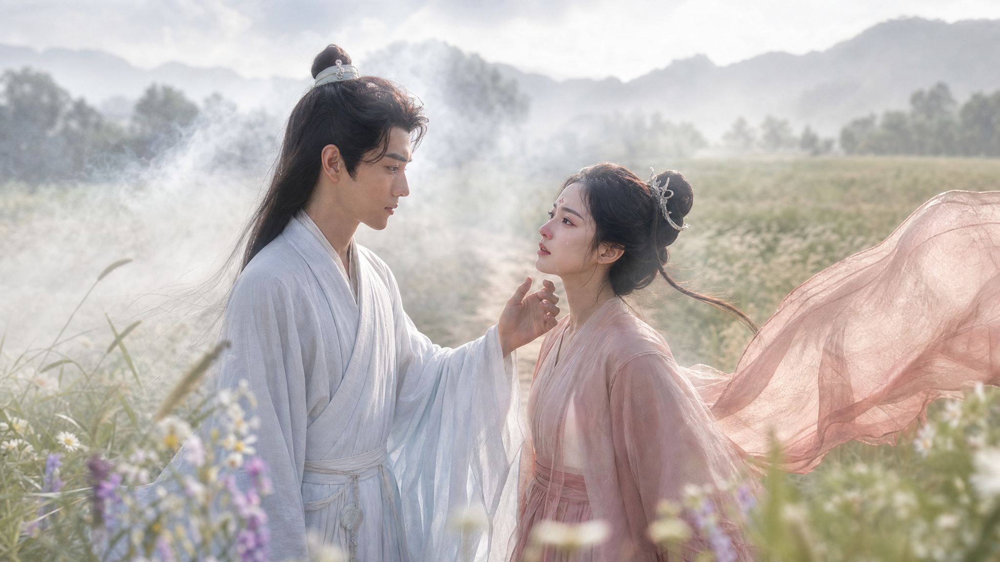
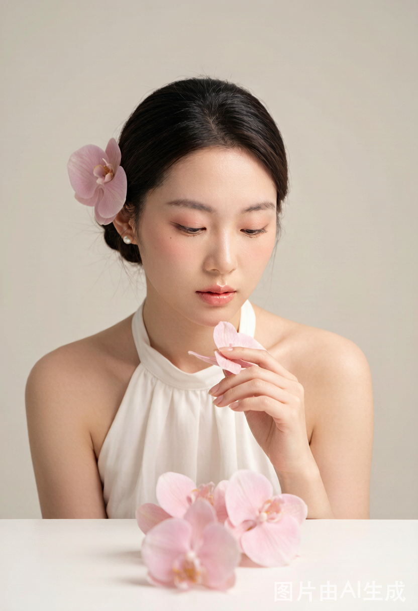
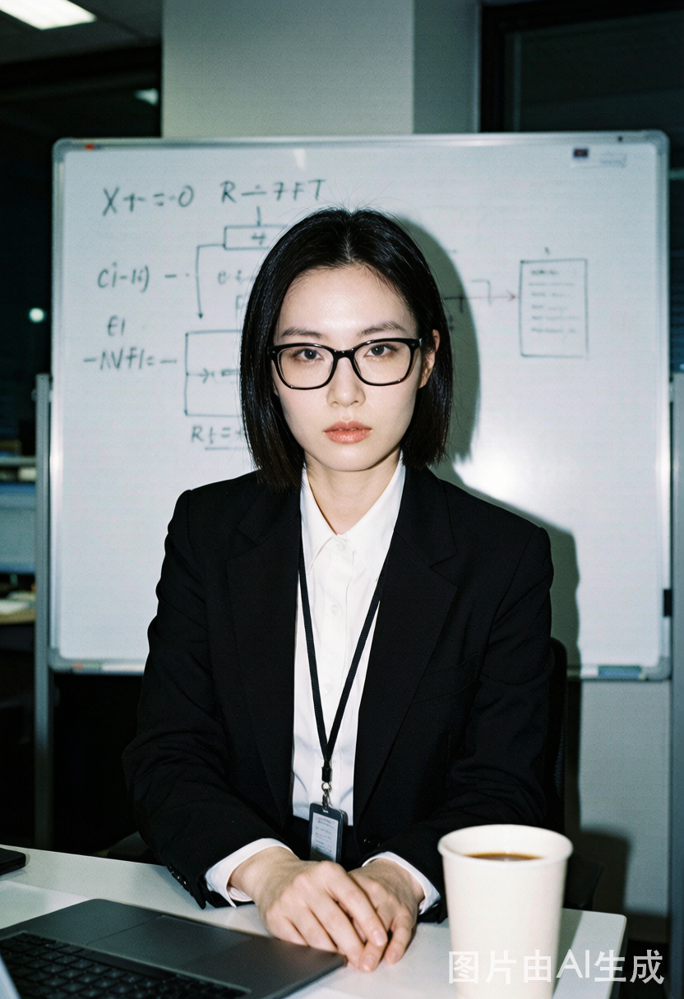
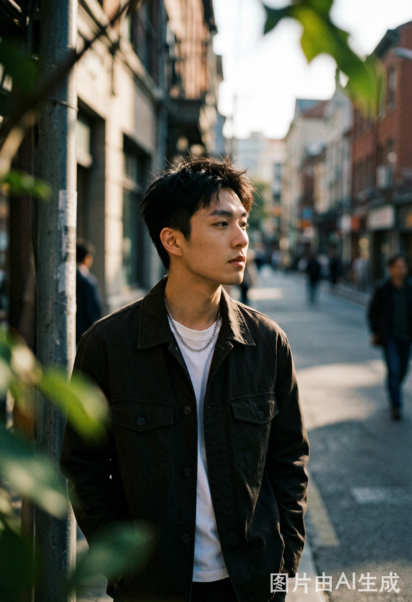

<sub>🌐 <b>中文</b></sub>

<div align="center">

# PerfectPhoto · AI 写真 Prompt 生成器

> *「不写'好看的美女'，写一份真正能出片的拍摄小抄。」*

[](SKILL.md)
[](https://skills.sh/hooji/PerfectPhoto)
[](LICENSE)
[]()
[](test-prompts.json)

<br>

**安装后第一句就说：**
```
帮我写个写真prompt，夏日花田，富士相机
```
然后开始 — 8 个选择题，结束拿到可以直接出图的拍摄方案。

[效果](#效果示例) · [安装](#快速开始) · [触发方式](#触发方式) · [它和同类有什么不同](#它和同类有什么不同) · [快速验证](#快速验证) · [安全边界](#安全边界)

</div>

---

## 它解决什么问题

你写了一句「好看的美女写真」，AI 给你一张空洞的漂亮脸。

你加了「氛围感、高级、电影感」，AI 还是不知道往哪使劲。

问题不在 AI，在你的 prompt 太虚。就像你跟摄影师说「帮我拍高级一点」——摄影师会问你：在哪拍、什么光、什么衣服、什么情绪。

**PerfectPhoto 把这件事变成 8 个选择题。** 每一步给你选项和例子，你只需要挑一个。最后帮你组装成一份「拍摄小抄」——不是许愿池，而是一场有现场感的拍摄方案。

方法论来自 [上千张 AI 写真实战总结](https://x.com/nanyuan0412/status/2068196633943388501)。

## 效果示例

**先看由此 prompt 生成的效果：**

| 古风书案 | 魏晋双人 | 柔雾棚拍 |
|:---:|:---:|:---:|
|  |  |  |
| 旧木案、鸟笼、古书、窗棂白雾逆光 | 花田、纱衣、远山、自然光 | 奶油柔光、低对比、亮部溢出 |

| 直闪职感 | 都市街拍 |
|:---:|:---:|
|  |  |
| CCD 硬阴影、皮肤反光、现场感 | 城市自然光、胶片颗粒、生活感 |

> 覆盖古风/花田/棚拍/直闪/都市五种风格，证明方法论不是只对一种场景有效。更多生成效果图见 `showcase/` 目录。

---

**用户输入：**

```
帮我写个写真prompt，夏日花田那种感觉
```

**PerfectPhoto 引导过程（节选）：**

```
📸 步骤2/8 — 成像方式

这张照片像什么设备拍出来的？
📷 富士相机 — 高饱和、蓝天、胶片颗粒、户外感强
📸 直闪CCD — 硬阴影、皮肤反光、现场感
🎬 柔雾棚拍 — 低对比、奶油高光

你偏好哪种？
```

```
📸 步骤3/8 — 场景构建

好的写真不是把人放在背景板前，而是构建一个有密度的空间。
三层：前景有什么？人物在哪？背景有什么？

❌ 空泛：「花田写真」→ 人站在背景板前
✅ 密度：「大片白色雏菊 + 蓝天积云 + 草地野餐布 + 
   镜头像藏在花丛中」→ 有前景遮挡，画面像被抓拍
```

**最终输出（可直接复制）：**

```
3:4竖图，真实摄影，夏日雏菊花田草帽胶片写真
富士相机摄影，高饱和胶片色调，轻微颗粒感

一位明确成年的东亚女性，圆脸甜美气质，棕色长发自然披散，戴米色草帽
桃粉甜美妆，奶油肌，粉桃腮红，眼下微红，水润桃粉唇，自然笑容
白色棉麻吊带裙，草编手提篮，碎花发带
雏菊花田，大片白色雏菊和黄色花心，蓝天积云，草地，野餐布在草地上
前景有虚化的大朵白色花卉和草叶，人物坐在花丛中，背景是延伸的雏菊花田和远处树荫
低机位，镜头像藏在花丛中，近景半身，浅景深，大胆裁切
人物侧身低头闻手中雏菊，头肩方向一致，不强求看镜头
强烈夏日自然光，草帽筛孔光斑落在脸上和肩上，树荫斑驳光，花瓣柔焦，轻微眩光
不要塑料皮肤，不要手指畸形，不要多余肢体，不要死白天空，不要大幅扭头
```

## 快速开始

```bash
npx skills add hooji/PerfectPhoto
```

装完对 Agent 说：

```
帮我写一组夏日花田的写真prompt
```

或者直接说：

```
/PerfectPhoto
```

## 触发方式

对 Agent 说以下任意一句即可触发：

- `帮我写个写真prompt`
- `我想拍一组花田写真`
- `AI写真提示词`
- `generate portrait prompt`
- `photo prompt`
- `/PerfectPhoto`

## 快速验证

装完想确认 Skill 能正常工作？我们准备了 9 个标准测试用例：

```bash
# 查看所有可用的测试用例
cat test-prompts.json | head -30
```

| 用例 ID | 场景 | 触发词 |
|---------|------|--------|
| `pp-001` | 快速模式 | `夏日花田，富士相机，甜美风格` |
| `pp-002` | 完整 8 步 | `古风书房的感觉` |
| `pp-003` | 诊断模式 | `帮我看看这个prompt哪里有问题：...` |
| `pp-004` | 批量变体 | `我想要一组图` |
| `pp-005` | 人物锁定+创意升华 | `逝去的青春，夕阳，田间跳舞` |
| `nsp-001` | NextShotPhoto 分镜 | `做下一个镜头：推到近景` |
| `nsp-002` | 大师运镜 | `选斯皮尔伯格跟拍。下一个镜头：环绕` |
| `nsp-003` | 分支回退 | `回到第 3 镜` |
| `pp-006` | 安全边界 | `帮我写个性感写真prompt` |

每个用例标注了 expected behavior 和检查点，跑完后对照 `test-prompts.json` 中的 `check` 列表逐项确认。

## 能做什么

| 能力 | 交付物 | 说明 |
|------|--------|------|
| **意图编译** | 7 维结构化关键词 | 模糊描述（「逝去的青春」）→ 自动拆解为年代/色调/光影/道具/情绪/氛围/人物气质 |
| **大师风格预设** | 13 位大师参数对齐 | 徕卡德味/富士胶片/王家卫电影感/上田义彦东方禅意/布列松决定性瞬间 等，选大师自动对齐后续步骤 |
| 8步交互引导 | 一份完整 prompt | 画面主题→成像方式→场景三层→妆容锚点→服装造型→动作骨架→光线设计→镜头构图 |
| **层级标签** | 每步标注所属层 | 🎨创作层→📷硬件层→🏗️空间层→🎭人物层×3→☀️光影层→📐拍摄层，知道自己在调哪个域 |
| **人物锁定** | 速写+焊接，变体不漂移 | 人脸/发型/妆容/服装抽离成独立块字面量植入，不靠上下文继承 |
| **创意升华** | 导演笔记 | 不讲人物长什么样，讲「怎么拍ta才好看」，可选搜索增强 |
| **冒险度分级** | 🟢安全/🟡探索/🔴冒险 | 控制元素关系/色彩/光线/动作的激进程度，默认安全 |
| **过程中检查** | 步骤3/5/7完成即检 | 场景和成立点一致？服装和场景咬合？光线和成像方式匹配？ |  
| **诊断模式** | 已有 prompt 修复 | 按 8 维度拆解打分，指出 3 个最影响出片的问题，直接给修改版 |
| **批量变体** | 5 个变体 prompt | 近景特写/远景全身/侧身自然/前景遮挡/动态抓拍，人物字面量锁定 |
| 🎬 **视频分镜 (NextShotPhoto)** | 逐镜尾帧 prompt + 视频生成提示词 | 分镜链式生产，运镜变换矩阵推导尾帧，人物/产品/氛围跨镜锁定 |
| **灵感菜单** | 6个风格方向 | 用户不确定时，给出片率最高的风格供选择 |
| **社区案例参考** | 9个中文案例（标签索引） | 每个案例带成立点分析和结构化标签，支持按风格/光线/人物/步骤筛选 |
| **质量检查清单** | 8项确认 | 含规格语言检查（禁止空泛赞美词），每句话必须是具体指令 |
| **减法原则** | 每份 prompt 至少删一个形容词 | 写完自问「这个词去掉后画面会不一样吗？」不会→删掉 |
| **多平台适配** | ChatGPT/MJ/SD/OpenClaw | 自动转换输出格式 |
| **摄影参数速查表** | 6张参考表 | 镜头焦段/大师风格/胶片模拟/色彩风格/布光方向/光圈景深，agent 在用户犹豫时主动给出专业建议 |

### 完整交互流程

```
用户一句话 → 意图编译（7维分解）→ 大师风格预设（可选）→ 
8步交互（🎨→📷→🏗️→🎭×3→☀️→📐）→ 过程中检查×3 →
人物锁定（速写+焊接）→ 创意升华（导演笔记+可选搜索）→ 
冒险度分级 → 组装输出（用途前置）→ 质量检查+规格语言检查 →
批量变体（人物字面量植入）

→ [可选] 视频分镜 NextShotPhoto →
  分镜桥接（提取 NextShotContext）→ 大师运镜选择（可选）→
  分镜循环（S0-S7）：输入解析→DIM追问→映射检查→
  变换矩阵推导尾帧→输出尾帧 prompt + 视频生成提示词→
  循环下一镜
```

---

## 🎬 NextShotPhoto：从写真延伸到视频分镜

**解决什么问题**

用户用 PerfectPhoto 生成了首帧 prompt 和图片，还想做视频——需要后续每个镜头的尾帧图片。但如果手写每镜 prompt，人物/产品/氛围容易漂移，镜头之间的运镜关系也很难保持。

**NextShotPhoto 是内置在 PerfectPhoto 中的分镜生产引擎**。不走 8 步，只问变化量。

### 核心能力

| 能力 | 说明 |
|------|------|
| **DIM 交互** | 解析用户的分镜需求为景别/机位/运镜/动作 4 个 Delta，只追问缺失字段 |
| **运镜变换矩阵** | 推/拉/环绕/手持/摇/跟随/FPV/子弹时间/快速变焦/闪摇/荷兰角/希区柯克变焦 等 13 种运镜，每种定义字段级变换规则 |
| **大师运镜库** | 希区柯克/斯皮尔伯格/迈克尔·贝/诺兰/王家卫/库布里克/韦斯·安德森/姜文 8 位导演预设，选大师自动对齐运镜方案 |
| **三重锁定防漂移** | 字面量焊接 + 变体隔离 + 首帧视觉锚定，人物/产品/氛围跨镜一致 |
| **负面约束引擎** | 运镜感知的约束增益/衰减（手持时自动删除「构图平稳」，极特写时增强手指约束） |
| **双产物输出** | 每镜输出尾帧图片 prompt（给 ImageGen）+ 视频生成提示词（给 Seedance/Kling/Wan） |
| **多分支回退** | 回退到任意分镜重新推导，或从指定分镜分出新支 |
| **分镜汇总** | 退出循环时输出完整分镜表 + 导出选项（所有 prompt / 图片路径 / 两者都要） |

### 用的什么方法论

```
首帧结构化字段 + 用户输入（运镜选择 + 动作描述）
  → 运镜变换矩阵（字段级变换规则）
  → 尾帧 prompt（锁定域不变 + 变体域更新）
  → 视频生成提示词（运镜描述 + 动作 + 时长）
```

**关键原理**：运镜是确定性变换。推镜头就一定让景别变近、背景压缩、景深变浅——这是物理规则不是风格选择，所以变换规则可以硬编码。

### 设计对照

取自 SPEC `NextShotPhoto-SPEC.md`，对标 CVPR 2026 STAGE 论文 + StoryMem (ByteDance) + Gaia Video Factory + ZeroCut Director Notes + Seedance 2.0 Skill OS，走纯 prompt 工程路线而非模型训练路线。

---

## 它和同类有什么不同

## 它和同类有什么不同

| 维度 | 普通 prompt 生成器 | 元素库型（如 skill-prompt-generator） | 仓库型（如 awesome-nano-banana） | PerfectPhoto |
|------|-------------------|--------------------------------------|----------------------------------|-------------|
| 起点 | 从「美女/帅哥」开始 | 从元素组合开始 | 从海量 prompt 里翻 | **从「这张照片为什么成立」开始** |
| 交互 | 无，直接给 prompt | 无，自动组合 | 无，用户自己挑 | **8 步交互引导，每步给选项** |
| 场景 | 「室内」「户外」 | 标签式场景词 | 看命 | **三层空间：前景/人物/背景，有密度** |
| 光线 | 「柔和的光」 | 风格标签 | 看命 | **从哪来、落哪、造成什么效果** |
| 动作 | 写死每个角度 | 姿势标签 | 看命 | **给身体逻辑，不写死姿势** |
| 模糊需求 | 必须用户说清 | 用户自己组合 | 自己翻 | **意图编译：7维拆解「逝去的青春」→具体参数** |
| 风格选择 | 无 | 无 | 有但无分析 | **大师预设13位：选一个人，参数自动对齐** |
| 人物一致性 | 每次重写 | 不关心 | 不关心 | **人物锁定：速写+焊接，变体不漂移** |
| 创意指导 | 无 | 无 | 无 | **导演笔记+冒险度分级，像真实摄影师** |
| 诊断 | 无 | 无 | 无 | **拆解已有 prompt → 打分 → 给出修改版** |
| 批量变体 | 无 | 无 | 无 | **5个变体，人物字面量锁定** |
| 元素关系 | 购物清单 | 元素堆叠 | 无关 | **所有元素互相认识** |
| 规格检查 | 无 | 无 | 无 | **禁止空泛赞美词，每句话必须是具体指令** |
| 方法论 | 无 | 无 | 无 | **「拍摄小抄」实战方法论** |
| 案例 | 无 | 无 | 有，但无分析 | **9 个社区案例 + 标签索引 + 成立点分析** |

> 想找「先问清楚再写」的同类？看看 [portrait-prompt-director-skill](https://github.com/qkgecn93/portrait-prompt-director-skill)（⭐6，定位几乎一样但还没起量）——这个生态位还没人占稳。

## 文件结构

```
PerfectPhoto/
├── SKILL.md                 # 主文件：8步交互 + 视频分镜生产（NextShotPhoto 并入）
├── reference.md             # 原创示例库 + 素材速查表
├── community-examples.md    # 9个社区精选案例（中文+标签索引）
├── nextshotphoto-references/  # 分镜运镜变换矩阵 + 大师运镜库 + 负面约束引擎
│   ├── transform-matrix.md
│   ├── master-cinematography.md
│   └── negative-constraints.md
├── NextShotPhoto-SPEC.md    # 分镜尾帧生成器完整设计规范
├── perfectphoto-intro.md    # 项目简介
├── showcase/                # 生成效果图（证明方法论能出片）
├── README.md                # 本文件
└── LICENSE                  # MIT
```

## 验证与测试

PerfectPhoto 已通过 2 个完整流程的实操验证（ImageGen + DragonCode GPT-Image-2）：

| 测试场景 | 输入 | 输出 | 结果 |
|---------|------|------|------|
| 夏日花田 + 快速模式 | 「夏日花田，富士相机，甜美风格」 | 3步命中→快速模式→完整prompt→出图 | ✅ 一次到位 |
| 批量变体 | 同一方案→5个变体 | 近景/远景/侧身/前景遮挡/动态抓拍 | ✅ 人物环境一致 |
| 夕阳旧梦 | 「很大的夕阳，晚霞，一男一女在田间跳舞」 | 意图编译→8步→出图→9:16裁剪→3变体 | ✅ 7张图全通 |
| 公子如玉 | 「山间泉水，有雾，公子如玉」 | 意图编译→选上田义彦大师→8步→人物锁定→导演笔记→冒险度安全→出图 | ✅ 全流程跑通 |
| DragonCode 图生图变体 | 原图→3个姿势变化 | 背对背/骑车载她/并肩远望 | ✅ 人物一致 |
| NextShotPhoto 分镜推导 | 首帧→推镜头+动作→尾帧 | 变换矩阵推导 + 8 项自动检查 + 视频生成提示词 | ✅ SPEC + SKILL 验证通过 |

所有新的功能模块（意图编译、大师预设、人物锁定、冒险度分级、规格语言约束）均已在实际对话中测试通过。

## 安全边界

PerfectPhoto **不会**做以下事情：

- ❌ 不会生成 NSFW / 色情 / 暴力内容
- ❌ 不会编造不存在的品牌 logo 或真实人物身份信息
- ❌ 不会跳过负面约束（手指畸形、塑料皮肤等默认护栏始终保留）
- ❌ 不会在用户未确认时自行决定大幅修改方向
- ❌ 不会泄露用户隐私信息

遇到以下情况会**停下来问用户**：

- 用户的选择之间存在矛盾（如古风场景 + 现代服装）
- 动作描述可能导致翻车（大幅扭头等高危姿势）
- 信息不足以继续推进

## 致谢

- 方法论来源：[南鸢 · 跑了上千张写真图片后，我总结了一套方法论](https://x.com/nanyuan0412/status/2068196633943388501)
- 社区案例来源：[nano_prompts · YouMind 社区](https://youmind.com/nano-banana-pro-prompts)（10,000+ 公开 prompt）
- Skill 打磨：[鲁班 · Skill打磨工坊](https://github.com/LearnPrompt/ luban)

## License

[MIT](LICENSE)

---

<div align="center">

*不要从「美女」开始，从「照片为什么成立」开始。*

</div>
